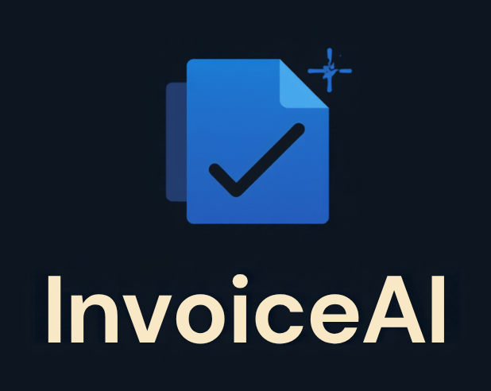
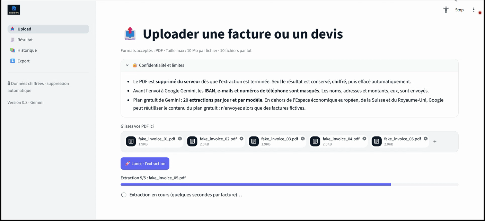
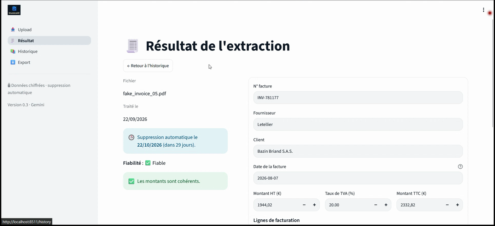
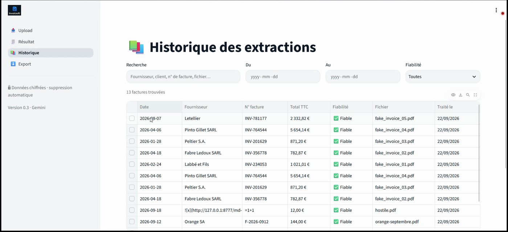
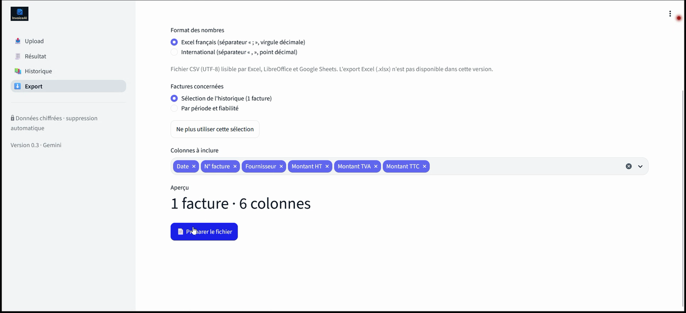

<p align="left"></p>

# InvoiceAI

> AI-powered extraction of structured data (supplier, dates, amounts, line items)
> from PDF invoices and quotes, exported to CSV/Excel.

Portfolio project by [Ibrahima](https://github.com/) — Junior PHP/Symfony developer,
training to steer projects and pick up new stacks with AI as a copilot, not a
replacement for learning.

**Status**: ✅ API and Streamlit interface complete (extraction, encrypted storage, CSV export, 4 screens, 678 tests), verified in a real browser (light + dark theme, security checks). See [`PROJECT_BRIEF.md`](PROJECT_BRIEF.md) for the full spec.

---

## What it does

Upload a PDF invoice/quote → the app extracts the supplier, dates, HT/VAT/TTC
amounts and line items via a Gemini-powered LLM pipeline, validates the numbers
for consistency (LLMs hallucinate), and lets you export the result to CSV.

## Screenshots

<table>
<tr>
<td width="50%">

**Upload** — batch of PDFs, extraction progress



</td>
<td width="50%">

**Résultat** — editable form, reliability check



</td>
</tr>
<tr>
<td width="50%">

**Historique** — filters, hostile content shown as plain text (no injection)



</td>
<td width="50%">

**Export** — CSV with formula-injection neutralised



</td>
</tr>
</table>

The app ships a native light/dark theme (Streamlit's own `[theme.light]` /
`[theme.dark]`, switchable from ⋮ → Settings → Theme) — no custom CSS.

## Stack (V1)

| Layer | Tech |
|---|---|
| Language | Python 3.11+ |
| LLM | Google Gemini (`gemini-flash-latest`) via `langchain-google-genai` |
| PDF text extraction | `pdfplumber` |
| API | FastAPI + Pydantic v2 |
| Database | SQLite + SQLAlchemy 2.x |
| UI | Streamlit |
| Tests | `pytest` |
| Lint/format | `ruff` |

No Docker / CI in V1 — deliberately kept lean for a portfolio MVP (see
[`PROJECT_BRIEF.md`](PROJECT_BRIEF.md) §4 and §9 for the reasoning). Both are
planned for the P5 phase.

## Getting started

```bash
python -m venv .venv
.venv\Scripts\activate        # Windows
pip install -r requirements.txt

copy .env.example .env        # then fill in GOOGLE_API_KEY
python scripts/generate_cache_key.py   # -> CACHE_ENCRYPTION_KEY in .env (BACK IT UP)
python scripts/generate_api_token.py    # -> API_TOKEN in .env
python scripts/generate_fake_invoices.py   # generate 5 test PDFs in data/fake_invoices/

python scripts/run.py         # start the API + the interface (Ctrl+C stops both)
python -m pytest              # run tests
# make api / make dev / make test are also available if `make` is installed
python -m ruff check . && python -m ruff format --check .   # lint
```

## Security & GDPR

This project handles invoice data (personal + accounting data). Non-negotiable
controls (see [`PROJECT_BRIEF.md`](PROJECT_BRIEF.md) §5):

- **Local, single-user tool.** The API listens on `127.0.0.1` only and every route (except
  `/health`) needs `Authorization: Bearer <API_TOKEN>`. **Do not expose it to the Internet
  as is**: there are no user accounts and no TLS. Multi-user (accounts, TLS) is a V2 topic.
- Upload validation: max 10 MB, `application/pdf` MIME **and** `%PDF-` bytes, server-generated
  file names, the PDF is deleted as soon as it has been processed
- Invoice data is encrypted at rest (Fernet) in the database and the cache; **lose
  `CACHE_ENCRYPTION_KEY` = lose the history**
- CSV export neutralises spreadsheet formulas (CSV injection)
- Free-tier Gemini: use fake data unless you are in the EEA/CH/UK or on a paid plan
- Configurable data retention (`DEFAULT_RETENTION_DAYS`, 30 days) + `DELETE /invoices/{id}` (record and cache)
- LLM output validated against arithmetic consistency rules before being trusted
- Quota handling on the Gemini free tier (measured: 20 requests/day/model) + SHA-256 encrypted cache

Full checklist: [`docs/security/SECURITY_CHECKLIST.md`](docs/security/SECURITY_CHECKLIST.md)

## Project docs

- [`PROJECT_BRIEF.md`](PROJECT_BRIEF.md) — full V1.0 spec (source of truth)
- [`PROJECT_CONTEXT.md`](PROJECT_CONTEXT.md) — living architecture/decisions doc
- [`TASKS.md`](TASKS.md) — phase-by-phase backlog
- [`DECISIONS.md`](DECISIONS.md) — decision log
- [`docs/security/`](docs/security/) — security reviews per phase (P2, P3)

## License

Portfolio project — not licensed for commercial reuse.
