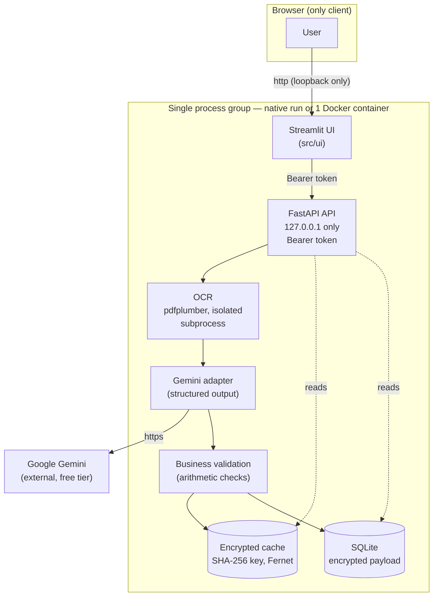
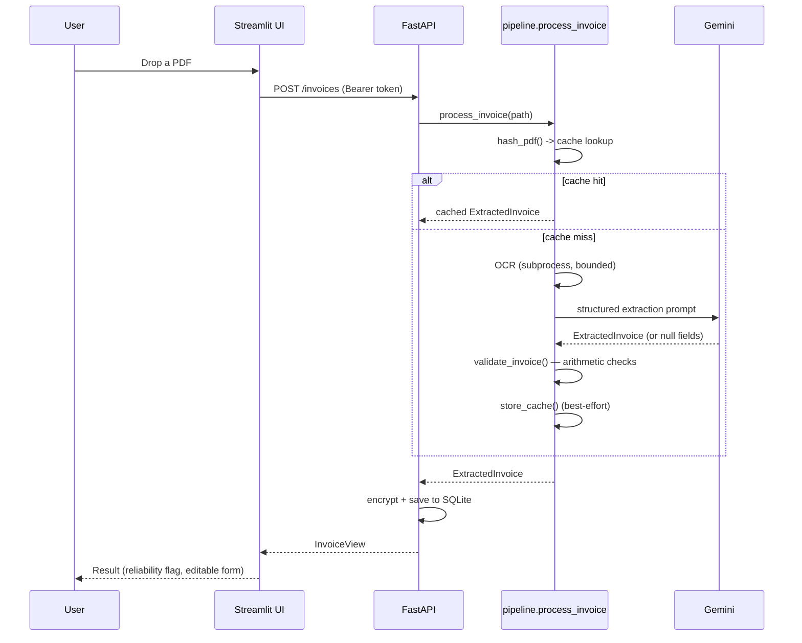

# Architecture

> High-level view of how InvoiceAI is built. For per-module contracts and design decisions,
> see [`TECHNICAL_DESIGN.md`](TECHNICAL_DESIGN.md); for the "why" behind the scope, see
> [`PROJECT_BRIEF.md`](../PROJECT_BRIEF.md).

## Components

**Why these boundaries:**
- The UI never touches OCR, the LLM or storage directly — everything goes through the API
  (same security layer, whether the caller is this UI or something else later).
- The API only listens on `127.0.0.1`: it is a local, single-user tool by design (see
  [Security & GDPR](../README.md#security--gdpr) in the README), not a multi-tenant service.
- OCR runs as an isolated subprocess (`src/ocr/worker.py`) with no access to the Gemini or
  encryption keys — a malicious PDF can at worst crash a process that gets killed on timeout.
- The cache and the database share one encryption key (`CACHE_ENCRYPTION_KEY`): both hold the
  same trust boundary (personal data extracted from invoices).

## Request flow (upload → result)

The uploaded PDF itself is never kept: it is deleted as soon as this request finishes,
successfully or not.

## Deployment

Two equivalent ways to run this, same code path either way (`src/launcher.py` orchestrates
both servers):

| | Native (`python scripts/run.py`) | Docker (`docker compose up`) |
|---|---|---|
| API bind | `127.0.0.1:8000` | `127.0.0.1:8000` (container-internal only) |
| UI bind | `127.0.0.1:8501` | `0.0.0.0:8501` inside the container, published to the host as `127.0.0.1:8501` |
| Secrets | `.env` (gitignored) | `--env-file .env` at `docker run`/compose time, never baked into the image |
| Data | `data/` on disk | named Docker volume, mounted at `/app/data` |

The API is never published to the host in the Docker setup either — only the UI is, and only
to the host's own loopback. See [`Dockerfile`](../Dockerfile) for why the UI (and only the UI)
binds `0.0.0.0` inside the container.

## Stack

See the [Stack table in the README](../README.md#stack-v1).
